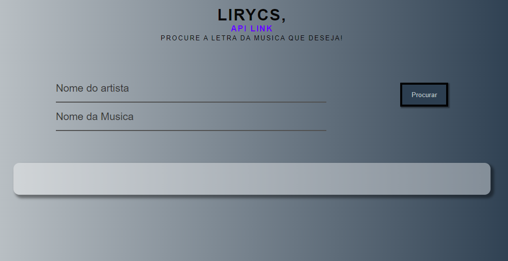
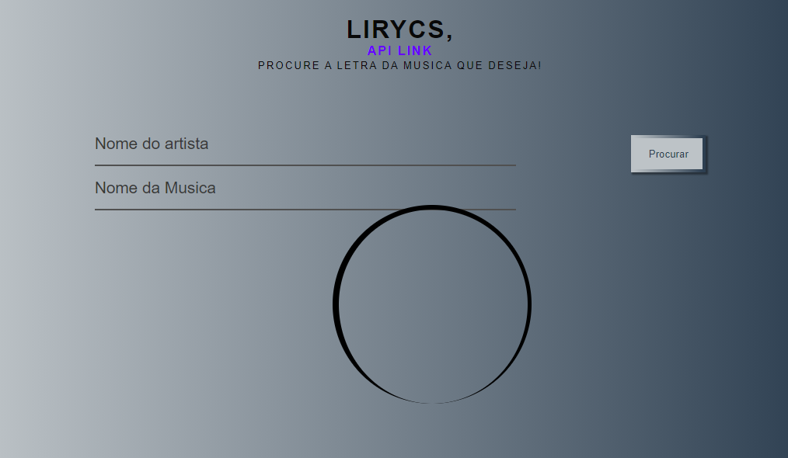
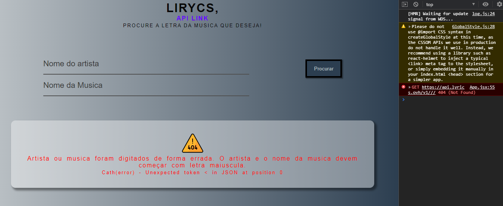
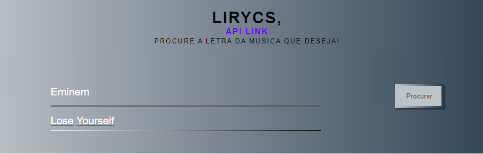
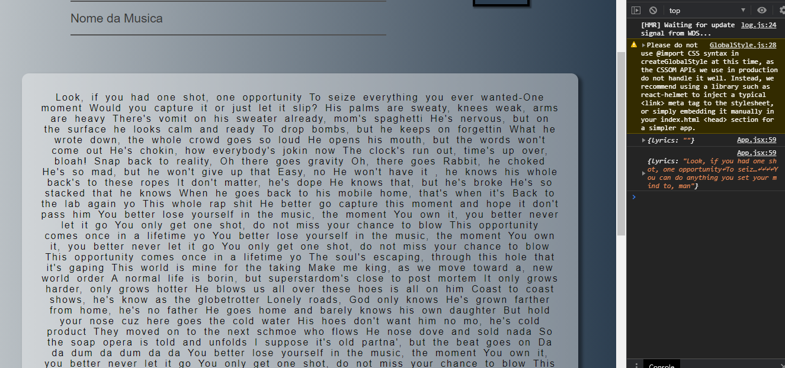

## Pt-br

    Ola, estou buscando intender melhor como funciona um API, e utiliza-las em meus projetos.

## En-us

    Hello, I'm looking to better understand how an API works, and use them in my projects.

`API LYRICS`
https://lyricsovh.docs.apiary.io/#

